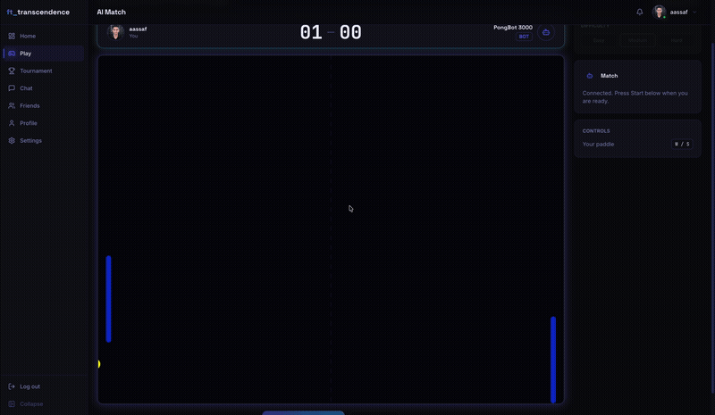
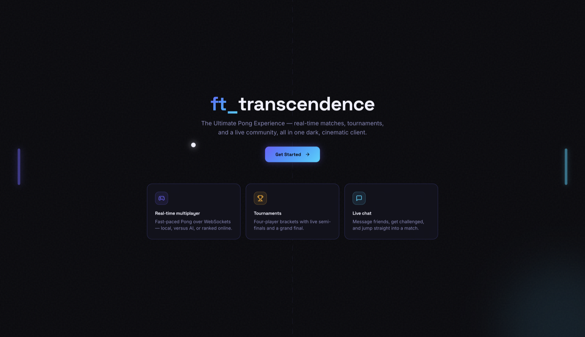
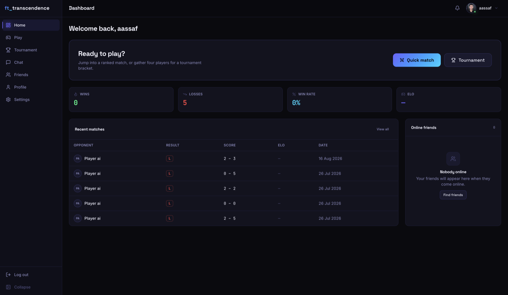
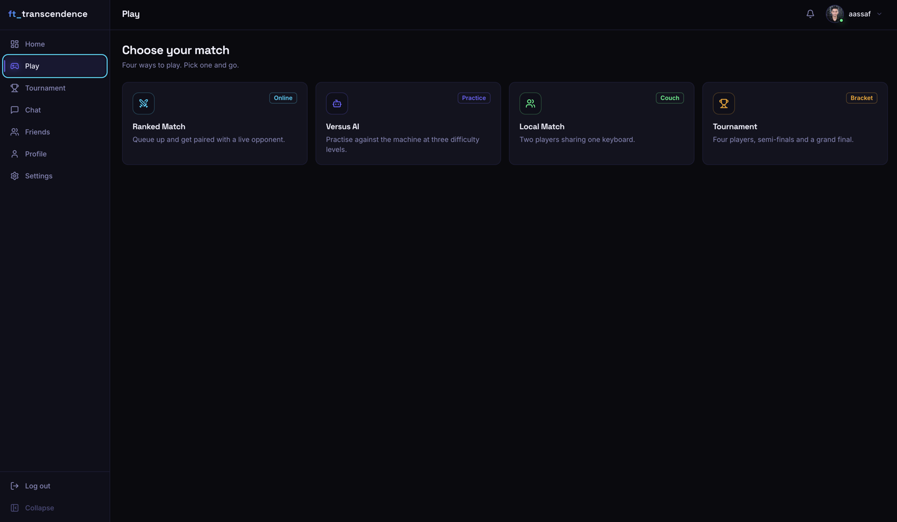
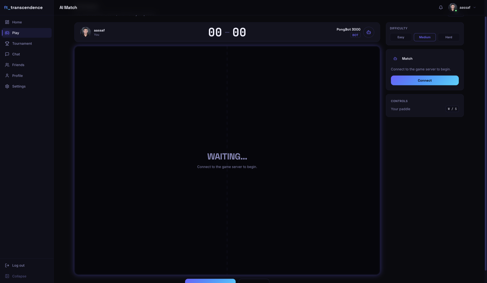
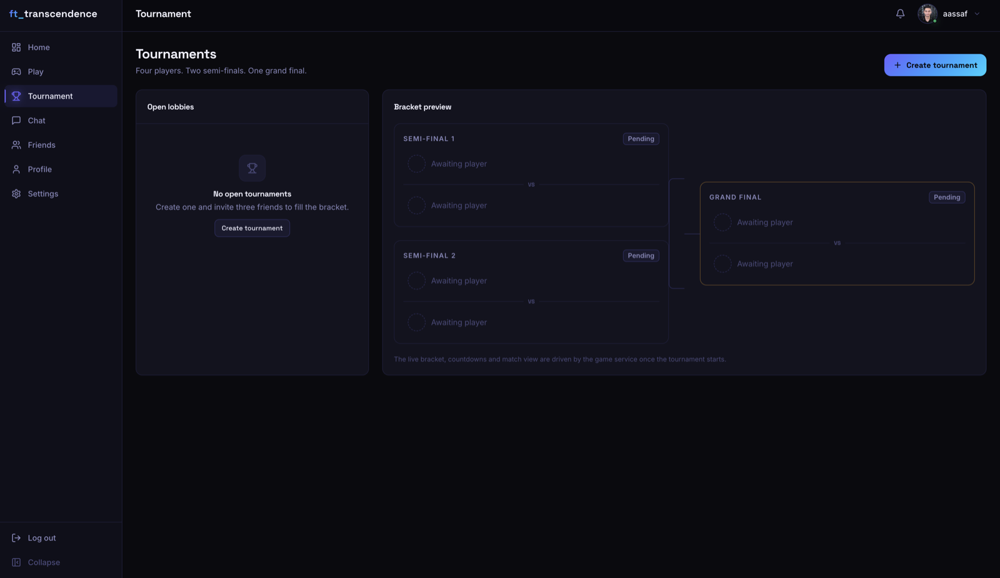
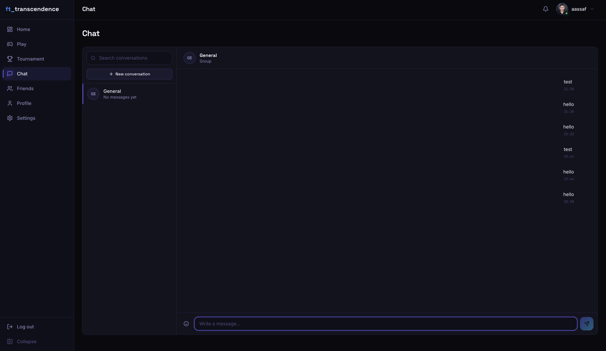
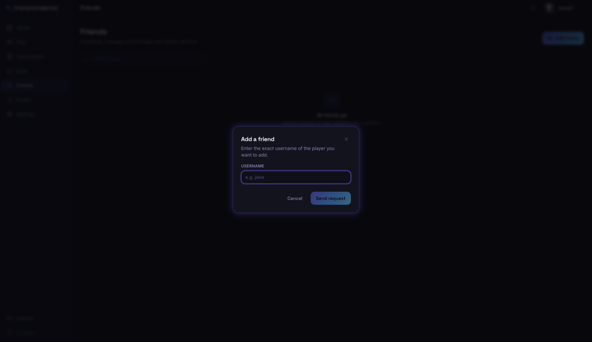
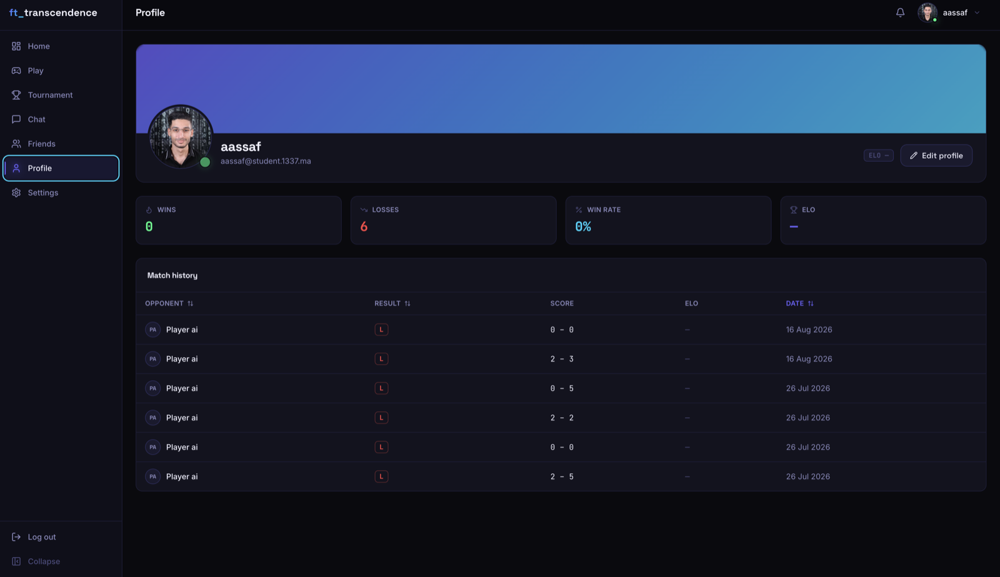
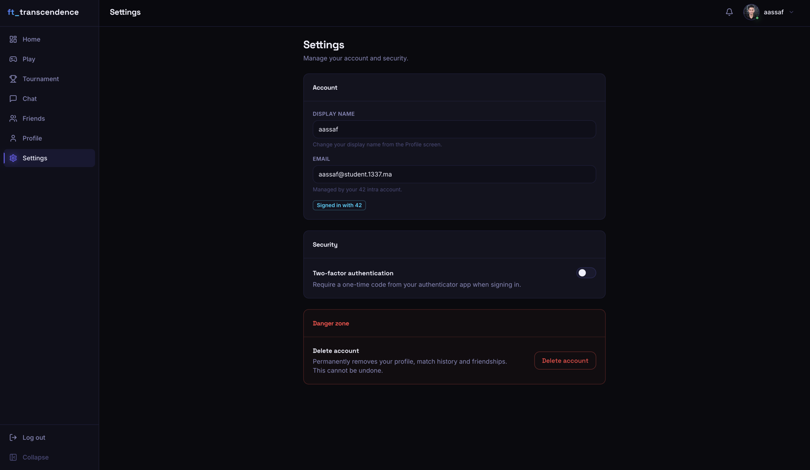

# ft_transcendence

**Real-time multiplayer Pong** — ranked matches, AI opponents, four-player tournaments, live chat
and a friends system, wrapped in a dark, cinematic client.



## Screens

| | |
|---|---|
| **Home** — landing page |  |
| **Dashboard** — stats, recent matches, quick play |  |
| **Play** — pick a match mode |  |
| **AI Match** — versus PongBot 3000 |  |
| **Tournament** — bracket preview |  |
| **Chat** — real-time messaging |  |
| **Friends** — add & manage friends |  |
| **Profile** — stats & match history |  |
| **Settings** — account, security, 2FA |  |

## Features

- **Real-time matches** over WebSockets — local (shared keyboard), versus AI (three difficulty
  levels), or ranked matchmaking against a live opponent
- **Tournaments** — four-player brackets with live semi-finals and a grand final
- **Live chat** — Socket.IO messaging, block/unblock, per-conversation actions
- **Friends** — requests, presence (online / in-game / offline), one-click challenges
- **42 OAuth login**, profile with match history and stats, 2FA support
- Fully responsive dark UI with motion-aware micro-interactions

## Stack

**Frontend** — React 18, Vite 5, TypeScript (strict), Tailwind CSS 3, Zustand, Framer Motion, Radix UI

**Backend** — Node.js microservices (Fastify): `auth-service`, `chat-service`, `game-service`,
`ai-service`, each with its own Prisma-backed SQLite store, fronted by nginx and communicating over
WebSockets for real-time game/chat state.

```
frontend (React/Vite) ──► nginx ──┬─► auth-service   (OAuth, profile, 2FA)
                                   ├─► chat-service    (Socket.IO messaging, friends)
                                   ├─► game-service    (WebSocket game engine, tournaments)
                                   └─► ai-service       (AI opponent)
```

## Running it

```bash
docker compose up --build
```

→ https://localhost:8080 (self-signed dev certificate — accept the browser warning)

Requires a `.env` at the repo root with service ports and a 42 intra OAuth application's
`FORTYTWO_UID`/`FORTYTWO_SECRET` (redirect URI: `http://localhost:3010/auth/42/callback`,
scope: `public`). See `frontend/.env.example` for frontend-specific overrides.

## About this project

`ft_transcendence` started as a team project for École 42's common core. This repository is a
personal continuation: I rebuilt the entire frontend from a ~99KB vanilla TypeScript monolith into
a componentized React application (see [`frontend/README-FRONTEND.md`](frontend/README-FRONTEND.md)
and [`frontend/DOM_CONTRACT.md`](frontend/DOM_CONTRACT.md) for the architecture and the specific
constraints of integrating a new UI layer with the project's existing real-time game/chat/tournament
logic without rewriting it), alongside backend fixes and the 42 OAuth integration. Git history is
preserved in full, including the original team's contributions.
